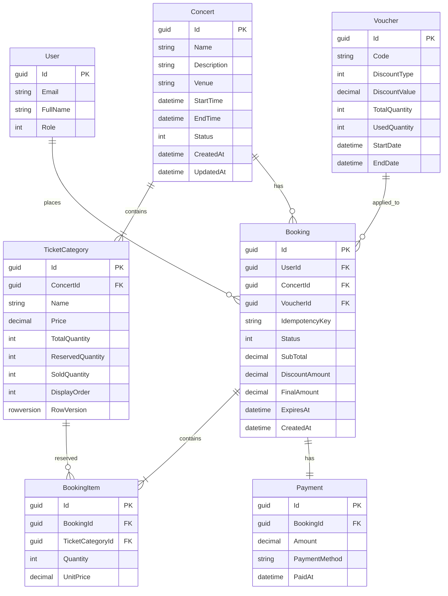

# Database Design

## Overview

The system is implemented as a relational database using SQL Server.

The current implementation focuses on the core booking workflow while keeping the design extensible for future enhancements.

---

# Current Implementation



---

# Business Decisions

## Prevent Overselling

Each TicketCategory maintains

- TotalQuantity
- ReservedQuantity
- SoldQuantity

Available quantity is calculated as

```

Available = Total - Reserved - Sold

```

Reservation is rejected when available tickets are insufficient.

Optimistic concurrency is supported using SQL Server RowVersion.

---

## Prevent Duplicate Booking

Each booking contains a unique IdempotencyKey.

If the client retries the same request, the system returns the existing booking instead of creating a duplicate booking.

---

## Preserve Historical Ticket Price

BookingItem stores UnitPrice.

Future ticket price changes do not affect existing bookings.

---

## Voucher

Voucher supports

- Percentage Discount
- Fixed Amount Discount

Voucher tracks UsedQuantity to prevent exceeding the configured usage limit.

---

## Payment Workflow

Booking

↓

Pending Payment

↓

Payment Success

↓

ReservedQuantity --

↓

SoldQuantity ++

↓

Booking Confirmed

---

# Index Strategy

The following indexes are recommended:

| Table | Index | Purpose |
|--------|-------|---------|
| Booking | IdempotencyKey (Unique) | Prevent duplicate booking |
| Voucher | Code (Unique) | Fast voucher lookup |
| TicketCategory | ConcertId | Retrieve tickets of a concert |
| Booking | Status | Monitor pending bookings |